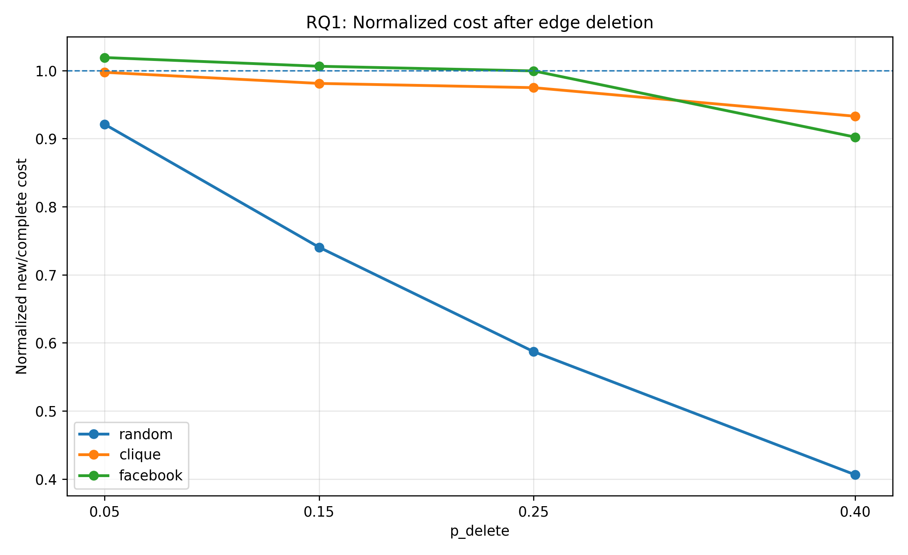
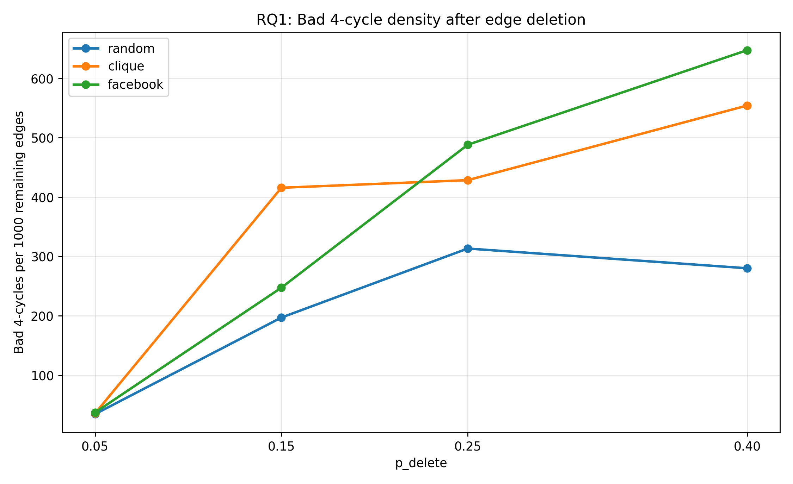
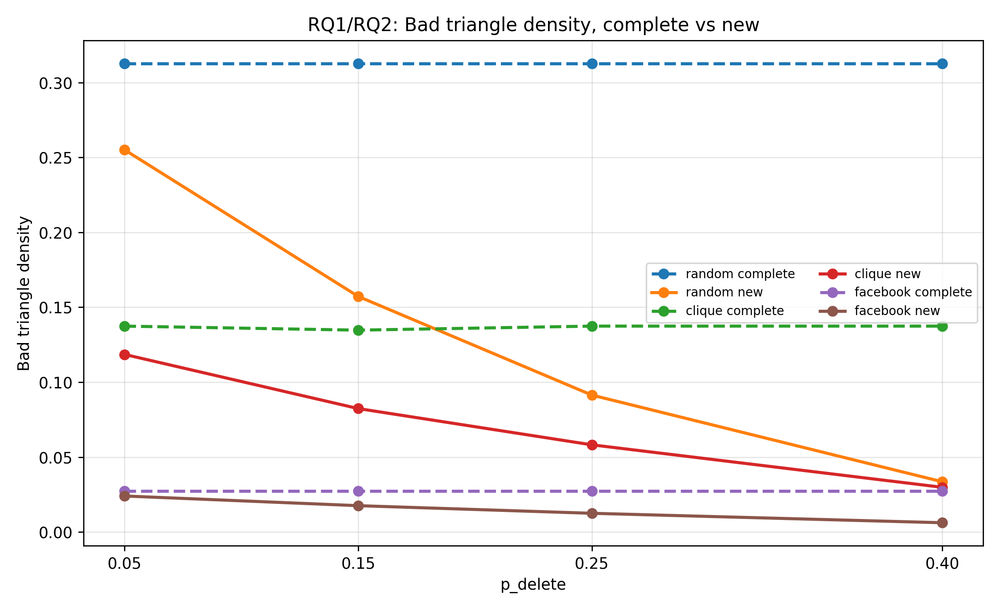
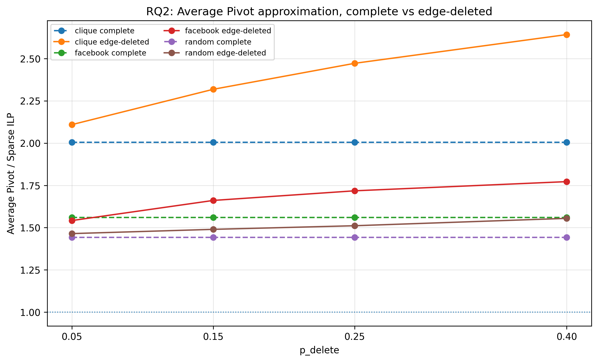
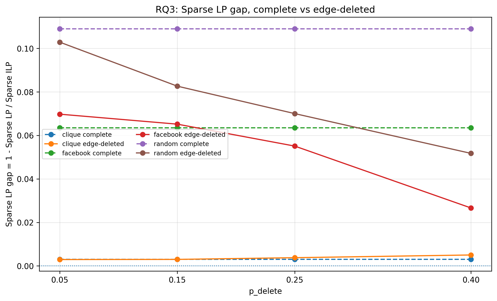

# Core thesis results

This report contains only the compact tables selected for the thesis: three tables per research question.

The full CSV versions are saved in `results/processed/tables/core_thesis_tables/`.
The final plots are saved in `results/processed/plots/core_thesis_figures/` and copied to `figures/thesis_plots/`.

Only complete p_delete units used: **True**.

## Final figures

1. `01_rq1_normalized_cost_ratio.png`
2. `02_rq1_bad4_density.png`
3. `03_bad_triangle_density_complete_vs_new.png`
4. `04_rq2_average_pivot_complete_vs_new.png`
5. `06_rq3_lp_gap_complete_vs_new.png`

## Important interpretation notes

These results should be interpreted as results for the tested formulation in this thesis. The edge-deleted Sparse ILP includes the constraints used in the experiments, including bad 4-cycle constraints, but it does not include all possible larger bad-cycle constraints. Therefore, a lower measured cost or normalized cost ratio should be read as a lower disagreement cost under this tested formulation, not as proof that the full sparse correlation clustering problem is always easier to solve.

The Pivot values should also be interpreted carefully. In the tables, Pivot is reported through the average Pivot result used in the experiments. This gives a more representative view of the randomized Pivot algorithm than selecting only the best run. The Facebook results are useful as real-world examples, but they are based on a small number of ego-networks and some larger Facebook rows have missing Sparse ILP-based ratios. Finally, the analysis is cost-based: it compares cost values, ratios, structural patterns and runtime, but it does not evaluate recovery of planted clusters with measures such as ARI or NMI.

## RQ1 — Edge deletion

### Table RQ1.1 — Cost effect and cost ratios

| graph_family | complete_sparse_ilp_mean | complete_cost_per_edge_mean | new_sparse_ilp_p0.05 | new_sparse_ilp_p0.15 | new_sparse_ilp_p0.25 | new_sparse_ilp_p0.40 | cost_ratio_p0.05 | cost_ratio_p0.15 | cost_ratio_p0.25 | cost_ratio_p0.40 | new_cost_per_edge_p0.05 | new_cost_per_edge_p0.15 | new_cost_per_edge_p0.25 | new_cost_per_edge_p0.40 | normalized_cost_ratio_p0.05 | normalized_cost_ratio_p0.15 | normalized_cost_ratio_p0.25 | normalized_cost_ratio_p0.40 |
| --- | --- | --- | --- | --- | --- | --- | --- | --- | --- | --- | --- | --- | --- | --- | --- | --- | --- | --- |
| clique | 46.004 | 0.093 | 43.713 | 38.678 | 34.134 | 27.076 | 0.949 | 0.834 | 0.733 | 0.561 | 0.093 | 0.092 | 0.091 | 0.087 | 0.997 | 0.979 | 0.975 | 0.933 |
| facebook | 323.000 | 0.053 | 308.667 | 273.000 | 240.333 | 185.000 | 0.969 | 0.860 | 0.752 | 0.541 | 0.054 | 0.054 | 0.053 | 0.049 | 1.019 | 1.006 | 0.999 | 0.902 |
| random | 45.170 | 0.224 | 40.858 | 31.743 | 23.197 | 12.662 | 0.878 | 0.631 | 0.443 | 0.246 | 0.210 | 0.179 | 0.145 | 0.096 | 0.921 | 0.740 | 0.587 | 0.406 |

**Analysis.** Table RQ1.1 shows that edge deletion lowers the absolute Sparse ILP cost for all graph families. This is expected, because fewer edges remain in the objective. The cost ratio and normalized cost ratio are therefore more informative than the absolute cost alone. Random graphs show the strongest decrease: at `p_delete = 0.40`, the cost ratio is 0.246 and the normalized cost ratio is 0.406. This means that, under the tested formulation, the remaining random graphs have a much lower disagreement cost per remaining edge. This should not be interpreted as proof that the full sparse problem is easier in general, because deleting edges can also create larger bad cycles that are not included in this thesis beyond length 4. Clique/community graphs are more stable, with a normalized cost ratio of 0.933 at `p_delete = 0.40`, meaning the remaining graph keeps more of its original conflict structure. Facebook graphs are in between, ending at 0.902, but should be interpreted carefully because the sample is small.

**Figure 1. Normalized cost after edge deletion.**  
The random line goes down strongly as `p_delete` increases. It looks almost like a straight downward line over these four points, but I do not fit a mathematical model to it. So I would not call it logarithmic, exponential, or square-root shaped based on this plot alone. The main observation is that random graphs lose measured disagreement cost per remaining edge much faster than clique/community and Facebook graphs. This probably happens because random graphs contain many local triangle conflicts, and deleting edges removes many of those conflicts. Clique/community and Facebook graphs stay close to 1 for most deletion levels. Their flatter lines suggest that the remaining edges still keep much of the original graph structure. For Facebook, the line only clearly drops at `p_delete = 0.40`, but this should be read carefully because there are only a few Facebook graphs.

### Table RQ1.2 — Structural conflict changes

| graph_family | complete_bad_triangle_density_mean | new_bad_triangle_density_p0.05 | new_bad_triangle_density_p0.15 | new_bad_triangle_density_p0.25 | new_bad_triangle_density_p0.40 | bad_triangles_removed_p0.05 | bad_triangles_removed_p0.15 | bad_triangles_removed_p0.25 | bad_triangles_removed_p0.40 | bad4_density_p0.05 | bad4_density_p0.15 | bad4_density_p0.25 | bad4_density_p0.40 |
| --- | --- | --- | --- | --- | --- | --- | --- | --- | --- | --- | --- | --- | --- |
| clique | 0.137 | 0.119 | 0.084 | 0.058 | 0.030 | 13.4% | 38.3% | 57.4% | 78.0% | 35.519 | 227.291 | 428.457 | 554.256 |
| facebook | 0.027 | 0.024 | 0.018 | 0.012 | 0.006 | 11.7% | 35.3% | 53.8% | 77.8% | 36.981 | 247.280 | 488.101 | 647.520 |
| random | 0.313 | 0.255 | 0.157 | 0.091 | 0.034 | 22.0% | 56.9% | 76.6% | 91.6% | 34.290 | 196.957 | 313.257 | 279.996 |

**Analysis.** Table RQ1.2 shows that bad triangle density decreases for all graph families as more edges are deleted. This decrease is strongest for random graphs, where 91.6% of bad triangles are removed at `p_delete = 0.40`. This helps explain the strong decrease in the measured normalized cost ratio for random graphs. At the same time, bad 4-cycle density increases strongly after edge deletion, especially for clique/community and Facebook graphs. This is an important nuance: edge deletion removes many triangle conflicts, but it also creates sparse cycle structures. Since this thesis only adds constraints for bad cycles up to length 4, the table captures part of this sparse-cycle effect but not necessarily all larger bad cycles.

**Figure 2. Bad 4-cycle density after edge deletion.**  
The clique/community and Facebook lines go up strongly when more edges are deleted. This is not a flat pattern; the increase becomes especially clear from `p_delete = 0.15` onward. A likely reason is that deleting edges creates more missing diagonals, and missing diagonals make sparse bad 4-cycles possible. Random graphs also go up first, but after `p_delete = 0.25` the line goes slightly down. This may happen because the random graphs become so sparse that fewer 4-cycles are left at all. This figure is important because it shows that edge deletion does not only remove conflicts; it can also create new sparse cycle conflicts.

**Figure 3. Bad triangle density in complete and edge-deleted graphs.**  
The dashed complete lines are horizontal because the complete graph does not change when `p_delete` changes. The solid edge-deleted lines go down when more edges are removed. Random graphs start with the highest bad triangle density and show the strongest decrease. This fits with Figure 1, where random graphs also show the strongest decrease in normalized cost. Clique/community graphs also decrease, but less sharply, because their community structure stays more stable. Facebook has the lowest bad triangle density overall, so these ego-networks seem to contain fewer triangle conflicts than the synthetic random graphs.

### Table RQ1.3 — Bad 4-cycle constraint effect

| graph_family | bad4_count_p0.05 | bad4_count_p0.15 | bad4_count_p0.25 | bad4_count_p0.40 | cost_changed_p0.05 | cost_changed_p0.15 | cost_changed_p0.25 | cost_changed_p0.40 | clustering_changed_p0.05 | clustering_changed_p0.15 | clustering_changed_p0.25 | clustering_changed_p0.40 | same_cost_diff_clustering_p0.05 | same_cost_diff_clustering_p0.15 | same_cost_diff_clustering_p0.25 | same_cost_diff_clustering_p0.40 |
| --- | --- | --- | --- | --- | --- | --- | --- | --- | --- | --- | --- | --- | --- | --- | --- | --- |
| clique | 83.047 | 481.573 | 795.590 | 821.800 | 0.0% | 0.6% | 4.5% | 18.3% | 0.8% | 3.0% | 8.8% | 23.2% | 0.8% | 2.6% | 6.0% | 10.4% |
| facebook | 379.333 | 2201.667 | 3783.000 | 3946.333 | 25.0% | 25.0% | 25.0% | 25.0% | 66.7% | 66.7% | 66.7% | 100.0% | 25.0% | 25.0% | 25.0% | 50.0% |
| random | 10.144 | 51.940 | 72.357 | 51.776 | 0.4% | 4.0% | 11.5% | 20.2% | 20.4% | 27.8% | 30.9% | 31.8% | 20.1% | 24.0% | 19.6% | 12.0% |

**Analysis.** Table RQ1.3 shows that bad 4-cycle constraints do not always change the objective cost, but they can still change the clustering solution. For clique/community graphs at `p_delete = 0.40`, the cost changes in 18.3% of runs, while the clustering changes in 23.2% of runs. For random graphs, the clustering changes in 31.8% of runs at the same deletion level. This means that the 4-cycle constraints are relevant not only for the objective value, but also for which clustering is selected. The Facebook rows show even stronger clustering changes, but these results should be read as only as an indication, because the Facebook sample is small. Also, these results only concern bad 4-cycle constraints; larger bad cycles may still exist outside the tested formulation.

## RQ2 — Input structure

### Table RQ2.1 — Method performance by graph family

| graph_family | pivot_complete_mean | sparse_lp_complete_mean | complete_bad_triangle_density_mean | pivot_new_p0.05 | pivot_new_p0.15 | pivot_new_p0.25 | pivot_new_p0.40 | sparse_lp_new_p0.05 | sparse_lp_new_p0.15 | sparse_lp_new_p0.25 | sparse_lp_new_p0.40 | normalized_cost_ratio_p0.05 | normalized_cost_ratio_p0.15 | normalized_cost_ratio_p0.25 | normalized_cost_ratio_p0.40 | median_runtime_p0.05 | median_runtime_p0.15 | median_runtime_p0.25 | median_runtime_p0.40 |
| --- | --- | --- | --- | --- | --- | --- | --- | --- | --- | --- | --- | --- | --- | --- | --- | --- | --- | --- | --- |
| clique | 2.005 | 0.997 | 0.137 | 2.110 | 2.319 | 2.472 | 2.642 | 0.997 | 0.997 | 0.996 | 0.995 | 0.997 | 0.979 | 0.975 | 0.933 | 0.466 | 0.389 | 0.337 | 0.318 |
| facebook | 1.560 | 0.937 | 0.027 | 1.542 | 1.661 | 1.718 | 1.772 | 0.930 | 0.935 | 0.945 | 0.973 | 1.019 | 1.006 | 0.999 | 0.902 | 214.915 | 262.969 | 149.832 | 126.051 |
| random | 1.443 | 0.891 | 0.313 | 1.465 | 1.490 | 1.511 | 1.555 | 0.897 | 0.917 | 0.930 | 0.948 | 0.921 | 0.740 | 0.587 | 0.406 | 0.394 | 0.349 | 0.286 | 0.247 |

**Analysis.** Table RQ2.1 shows that input graph family strongly affects method performance. Pivot performs worst on clique/community graphs after edge deletion: the Pivot/Sparse ILP ratio increases from 1.417 at `p_delete = 0.05` to 2.062 at `p_delete = 0.40`. Random graphs are more stable, with Pivot/Sparse ILP increasing only from 1.230 to 1.330. This suggests that Pivot is more sensitive to the loss of structured community information than to random edge deletion. These Pivot values are based on average Pivot over the experimental runs, so they give a more representative view of Pivot performance than selecting only the best run. Sparse LP behaves differently: it stays very close to Sparse ILP on clique/community graphs, with Sparse LP/Sparse ILP around 0.995–0.997, while it is less tight on random and Facebook graphs but improves as more edges are deleted.

**Figure 4. Average Pivot approximation on complete and edge-deleted graphs.**  
The complete Pivot lines are almost flat because the complete graphs are the same for every `p_delete` value. The edge-deleted clique/community line goes up strongly and looks roughly like a straight increasing line. This means Pivot becomes worse when structured community graphs become sparse. A likely reason is that Pivot needs local edge information to choose clusters. When edges are deleted, the community signal is less complete. Random graphs stay much flatter, probably because they already have less clear community structure. Facebook is between random and clique/community, but this line is based on only a few ego-networks with Sparse ILP values, so it should not be interpreted too strongly.

### Table RQ2.2 — Graph size as input to method output

| graph_family | n | runs | pivot_new_p0.05 | pivot_new_p0.40 | sparse_lp_new_p0.05 | sparse_lp_new_p0.40 | normalized_cost_ratio_p0.05 | normalized_cost_ratio_p0.40 | median_runtime_p0.05 | median_runtime_p0.40 |
| --- | --- | --- | --- | --- | --- | --- | --- | --- | --- | --- |
| clique | 10 | 600 | 1.785 | 2.337 | 0.998 | 0.992 | 0.997 | 0.813 | 0.042 | 0.027 |
| clique | 15 | 600 | 1.977 | 2.545 | 0.998 | 0.996 | 1.000 | 0.910 | 0.149 | 0.094 |
| clique | 20 | 600 | 2.078 | 2.530 | 1.000 | 0.996 | 0.997 | 0.939 | 0.413 | 0.254 |
| clique | 25 | 800 | 2.201 | 2.663 | 1.000 | 0.999 | 0.996 | 0.974 | 0.947 | 0.573 |
| clique | 30 | 800 | 2.361 | 3.019 | 1.000 | 1.000 | 0.996 | 0.980 | 1.750 | 1.071 |
| clique | 100 | 180 | 2.217 | 2.483 | 0.955 | 0.955 | 1.003 | 0.999 | 116.372 | 82.301 |
| facebook | 58 | 4 | 1.399 | 1.630 | 0.892 | 0.986 | 1.038 | 0.828 | 25.556 | 6.519 |
| facebook | 64 | 4 | 1.682 | 1.923 | 0.968 | 0.991 | 1.019 | 0.913 | 61.229 | 15.915 |
| facebook | 155 | 4 | 1.545 | 1.765 | 0.931 | 0.943 | 1.001 | 0.965 | 1644.134 | 514.034 |
| facebook | 170 | 4 | - | - | - | - | - | - | 368.601 | 236.188 |
| random | 5 | 1400 | 1.407 | 1.599 | 0.990 | 1.000 | 0.873 | 0.249 | 0.007 | 0.005 |
| random | 10 | 1400 | 1.454 | 1.655 | 0.966 | 0.984 | 0.917 | 0.363 | 0.045 | 0.029 |
| random | 15 | 1400 | 1.474 | 1.573 | 0.915 | 0.969 | 0.925 | 0.413 | 0.194 | 0.114 |
| random | 20 | 1400 | 1.481 | 1.537 | 0.875 | 0.949 | 0.932 | 0.446 | 0.606 | 0.373 |
| random | 25 | 1400 | 1.485 | 1.514 | 0.841 | 0.926 | 0.934 | 0.462 | 1.603 | 1.122 |
| random | 30 | 1400 | 1.474 | 1.485 | 0.816 | 0.895 | 0.939 | 0.480 | 11.479 | 3.275 |

Full table saved as `rq2_2_graph_size_effect_compact.csv`.

**Analysis.** Table RQ2.2 shows how graph size changes the output of the methods. For clique/community graphs, larger graphs mainly make Pivot worse: at `p_delete = 0.40`, Pivot/Sparse ILP rises from 1.545 for `n = 10` to 2.474 for `n = 30`. For random graphs, graph size mainly affects the Sparse LP relaxation: at `p_delete = 0.40`, Sparse LP/Sparse ILP decreases from 1.000 for `n = 5` to 0.895 for `n = 30`. This means that larger random graphs keep more structure that the Sparse LP relaxation does not capture as an integer solution. Runtime also increases strongly with size and real-world structure. This runtime effect belongs to RQ2, because it shows how input structure affects practical solvability. It should not be confused with the cost ratios from RQ1: a lower measured cost does not automatically mean the full sparse problem is easier to solve.

### Table RQ2.3 — Input-structure details at p_delete = 0.40

| input_type | input_setting | avg_n | p_delete | pivot_new | sparse_lp_new | normalized_cost_ratio | complete_bad_triangle_density | new_bad_triangle_density | median_runtime |
| --- | --- | --- | --- | --- | --- | --- | --- | --- | --- |
| clique | 3-2-5 | 10.000 | 0.400 | 2.261 | 0.996 | 0.801 | 0.117 | 0.025 | 0.026 |
| clique | 3-3-4 | 10.000 | 0.400 | 1.929 | 0.992 | 0.739 | 0.114 | 0.026 | 0.027 |
| clique | 5-5 | 10.000 | 0.400 | 2.802 | 0.988 | 0.898 | 0.152 | 0.034 | 0.030 |
| clique | 5-5-3-2 | 15.000 | 0.400 | 2.153 | 0.989 | 0.860 | 0.098 | 0.022 | 0.093 |
| clique | 5-5-5 | 15.000 | 0.400 | 2.303 | 0.999 | 0.911 | 0.116 | 0.027 | 0.093 |
| clique | 8-7 | 15.000 | 0.400 | 3.177 | 1.000 | 0.959 | 0.171 | 0.038 | 0.096 |
| clique | 10-10 | 20.000 | 0.400 | 3.197 | 1.000 | 0.995 | 0.169 | 0.036 | 0.258 |
| clique | 5-5-5-5 | 20.000 | 0.400 | 1.989 | 0.990 | 0.892 | 0.098 | 0.020 | 0.253 |
| clique | 7-7-6 | 20.000 | 0.400 | 2.402 | 0.998 | 0.929 | 0.123 | 0.025 | 0.254 |
| clique | 10-10-5 | 25.000 | 0.400 | 2.503 | 0.998 | 0.969 | 0.137 | 0.029 | 0.572 |
| clique | 12-7-6 | 25.000 | 0.400 | 2.585 | 1.000 | 0.965 | 0.138 | 0.030 | 0.573 |
| clique | 13-12 | 25.000 | 0.400 | 3.199 | 1.000 | 0.988 | 0.175 | 0.038 | 0.568 |
| clique | 9-8-8 | 25.000 | 0.400 | 2.366 | 1.000 | 0.974 | 0.128 | 0.028 | 0.573 |
| clique | 10-10-10 | 30.000 | 0.400 | 2.552 | 1.000 | 0.971 | 0.133 | 0.028 | 1.097 |
| clique | 15-10-5 | 30.000 | 0.400 | 2.805 | 1.000 | 0.983 | 0.145 | 0.031 | 1.080 |
| clique | 15-15 | 30.000 | 0.400 | 3.325 | 1.000 | 0.995 | 0.176 | 0.038 | 1.056 |
| clique | 20-5-5 | 30.000 | 0.400 | 3.394 | 0.999 | 0.969 | 0.168 | 0.036 | 1.053 |
| clique | 10-10-10-10-10-10-10-10-10-10 | 100.000 | 0.400 | 1.634 | 0.866 | 0.997 | 0.063 | 0.014 | 126.204 |
| clique | 25-25-25-25 | 100.000 | 0.400 | 2.436 | 1.000 | 1.002 | 0.115 | 0.025 | 78.522 |
| clique | 60-25-10-5 | 100.000 | 0.400 | 3.380 | 1.000 | 0.998 | 0.158 | 0.034 | 82.248 |
| facebook | ego=3980.0 | 58.000 | 0.400 | 1.630 | 0.986 | 0.828 | 0.020 | 0.004 | 6.519 |
| facebook | ego=698.0 | 64.000 | 0.400 | 1.923 | 0.991 | 0.913 | 0.025 | 0.006 | 15.915 |
| facebook | ego=414.0 | 155.000 | 0.400 | 1.765 | 0.943 | 0.965 | 0.029 | 0.006 | 514.034 |
| facebook | ego=686.0 | 170.000 | 0.400 | - | - | - | 0.036 | 0.009 | 236.188 |
| random | p+=0.200 | 17.500 | 0.400 | - | - | 0.000 | 0.094 | 0.000 | 0.179 |
| random | p+=0.300 | 17.500 | 0.400 | - | - | 0.000 | 0.183 | 0.000 | 0.207 |
| random | p+=0.400 | 17.500 | 0.400 | - | - | 0.000 | 0.277 | 0.000 | 0.252 |
| random | p+=0.500 | 17.500 | 0.400 | 1.473 | 0.951 | 0.188 | 0.367 | 0.012 | 0.306 |
| random | p+=0.600 | 17.500 | 0.400 | 1.484 | 0.915 | 0.459 | 0.433 | 0.045 | 0.278 |
| random | p+=0.700 | 17.500 | 0.400 | 1.517 | 0.933 | 0.827 | 0.449 | 0.082 | 0.220 |

Full table saved as `rq2_3_input_structure_details_p040.csv`.

**Analysis.** Table RQ2.3 gives a closer look at specific input structures at the strongest deletion level. For clique/community graphs, the exact community composition matters. For example, the clique setting `20-5-5` has Pivot/Sparse ILP = 2.752, while `5-5-5-5` has Pivot/Sparse ILP = 1.534. This suggests that imbalance and community structure can strongly affect Pivot. The random rows show that higher `p+` values lead to higher bad triangle density and higher normalized cost ratios. The Facebook rows show that real-world ego-networks can have moderate method quality but much higher runtime, especially for larger ego-networks. The row with missing Pivot/Sparse LP values should not be used for method-quality conclusions, but it can still support the runtime discussion.

## RQ3 — Sparse LP vs Sparse ILP

### Table RQ3.1 — Sparse LP gap by graph family

| graph_family | sparse_lp_complete_mean | sparse_lp_gap_complete_mean | sparse_lp_new_p0.05 | sparse_lp_new_p0.15 | sparse_lp_new_p0.25 | sparse_lp_new_p0.40 | sparse_lp_gap_new_p0.05 | sparse_lp_gap_new_p0.15 | sparse_lp_gap_new_p0.25 | sparse_lp_gap_new_p0.40 |
| --- | --- | --- | --- | --- | --- | --- | --- | --- | --- | --- |
| clique | 0.997 | 0.003 | 0.997 | 0.997 | 0.996 | 0.995 | 0.003 | 0.003 | 0.004 | 0.005 |
| facebook | 0.937 | 0.063 | 0.930 | 0.935 | 0.945 | 0.973 | 0.070 | 0.065 | 0.055 | 0.027 |
| random | 0.891 | 0.109 | 0.897 | 0.917 | 0.930 | 0.948 | 0.103 | 0.083 | 0.070 | 0.052 |

**Analysis.** Table RQ3.1 shows that the Sparse LP relaxation is closest to Sparse ILP for clique/community graphs. The complete Sparse LP gap is only 0.003, and the edge-deleted Sparse LP gap stays very small, from 0.003 to 0.005. Random graphs have the largest Sparse LP gap, with a complete Sparse LP gap of 0.109. However, under the tested formulation, edge deletion reduces the Sparse LP gap for random graphs from 0.103 to 0.052. Facebook graphs show a similar decrease from 0.070 to 0.027, although these results are based on a small sample. This should be interpreted as the Sparse LP becoming closer to the tested Sparse ILP formulation, not as a claim about the full sparse formulation with all larger bad-cycle constraints.

**Figure 5. Sparse LP gap in complete and edge-deleted graphs.**  
The clique/community Sparse LP gap stays very close to zero, so the Sparse LP relaxation is almost exact for these structured graphs. Random graphs have the largest complete Sparse LP gap, but the edge-deleted random line goes down as `p_delete` increases. This looks like a steady decreasing trend. It suggests that, for random graphs, edge deletion makes the tested Sparse LP relaxation closer to the tested Sparse ILP result. Facebook shows a similar decrease and becomes lower than random at higher deletion levels. This probably happens because deleting edges removes many local conflicts. This conclusion only applies to the model and constraints used here, not automatically to all larger sparse bad cycles.

### Table RQ3.2 — Sparse LP gap by graph size

| graph_family | n | runs | sparse_lp_new_p0.05 | sparse_lp_new_p0.40 | sparse_lp_gap_new_p0.05 | sparse_lp_gap_new_p0.40 |
| --- | --- | --- | --- | --- | --- | --- |
| clique | 10 | 600 | 0.998 | 0.992 | 0.002 | 0.008 |
| clique | 15 | 600 | 0.998 | 0.996 | 0.002 | 0.004 |
| clique | 20 | 600 | 1.000 | 0.996 | 0.000 | 0.004 |
| clique | 25 | 800 | 1.000 | 0.999 | 0.000 | 0.001 |
| clique | 30 | 800 | 1.000 | 1.000 | 0.000 | 0.000 |
| clique | 100 | 180 | 0.955 | 0.955 | 0.045 | 0.045 |
| facebook | 58 | 4 | 0.892 | 0.986 | 0.108 | 0.014 |
| facebook | 64 | 4 | 0.968 | 0.991 | 0.032 | 0.009 |
| facebook | 155 | 4 | 0.931 | 0.943 | 0.069 | 0.057 |
| facebook | 170 | 4 | - | - | - | - |
| random | 5 | 1400 | 0.990 | 1.000 | 0.010 | 0.000 |
| random | 10 | 1400 | 0.966 | 0.984 | 0.034 | 0.016 |
| random | 15 | 1400 | 0.915 | 0.969 | 0.085 | 0.031 |
| random | 20 | 1400 | 0.875 | 0.949 | 0.125 | 0.051 |
| random | 25 | 1400 | 0.841 | 0.926 | 0.159 | 0.074 |
| random | 30 | 1400 | 0.816 | 0.895 | 0.184 | 0.105 |

Full table saved as `rq3_2_lp_gap_by_size_compact.csv`.

**Analysis.** Table RQ3.2 shows that graph size affects the Sparse LP gap, especially for random graphs. At `p_delete = 0.40`, the Sparse LP gap for random graphs increases from 0.000 for `n = 5` to 0.105 for `n = 30`. This indicates that larger random graphs make the Sparse LP relaxation less tight. Clique/community graphs remain much tighter for `n = 10` to `n = 30`, where the Sparse LP gaps are close to zero. The `n = 100` clique/community graphs are an exception, with an Sparse LP gap of 0.045. This suggests that Sparse LP is generally strong for structured graphs, but very large structured instances can still create Sparse LP gaps. The Facebook size rows should be interpreted carefully because there are few runs and one larger row has missing method ratios.

### Table RQ3.3 — Worst Sparse LP gap cases

| graph_family | file_name | n | seed | p_delete_num | complete_sparse_lp_gap | edge_sparse_lp_gap | complete_sparse_lp_ratio | edge_sparse_lp_ratio_with4 | complete_bad_triangle_density | edge_bad_triangle_density |
| --- | --- | --- | --- | --- | --- | --- | --- | --- | --- | --- |
| random | random_n10_p02.json | 10 | 47 | 0.050 | 0.167 | 0.333 | 0.833 | 0.667 | 0.058 | 0.050 |
| random | random_n30_p03.json | 30 | 42 | 0.050 | 0.332 | 0.331 | 0.668 | 0.669 | 0.211 | 0.151 |
| random | random_n30_p03.json | 30 | 41 | 0.050 | 0.321 | 0.323 | 0.679 | 0.677 | 0.180 | 0.143 |
| random | random_n30_p04.json | 30 | 39 | 0.050 | 0.322 | 0.317 | 0.678 | 0.683 | 0.276 | 0.212 |
| random | random_n30_p04.json | 30 | 16 | 0.050 | 0.308 | 0.315 | 0.692 | 0.685 | 0.274 | 0.215 |
| random | random_n30_p03.json | 30 | 5 | 0.050 | 0.330 | 0.311 | 0.670 | 0.689 | 0.214 | 0.141 |
| random | random_n30_p04.json | 30 | 26 | 0.050 | 0.319 | 0.311 | 0.681 | 0.689 | 0.285 | 0.232 |
| random | random_n30_p04.json | 30 | 42 | 0.050 | 0.324 | 0.311 | 0.676 | 0.689 | 0.296 | 0.232 |
| random | random_n30_p04.json | 30 | 13 | 0.050 | 0.320 | 0.308 | 0.680 | 0.692 | 0.287 | 0.217 |
| random | random_n30_p02.json | 30 | 42 | 0.050 | 0.322 | 0.307 | 0.678 | 0.693 | 0.132 | 0.083 |
| random | random_n30_p03.json | 30 | 29 | 0.050 | 0.303 | 0.305 | 0.697 | 0.695 | 0.187 | 0.143 |
| random | random_n30_p04.json | 30 | 29 | 0.050 | 0.303 | 0.304 | 0.697 | 0.696 | 0.313 | 0.261 |

**Analysis.** Table RQ3.3 shows that the worst Sparse LP gap cases all occur in random graphs. Most of these cases have `n = 30` and low to moderate positive-edge probabilities. This supports the conclusion that Sparse LP struggles most with larger random graphs, where inconsistent local structures are harder for the relaxation to represent. The table also shows relatively high bad triangle densities in several worst cases, suggesting that local conflict structure is connected to a larger Sparse LP gap. However, this should be read as a pattern in the observed data, not as proof that bad triangles are the only reason for the Sparse LP gap.

## Limitations for interpreting the results

The results should be interpreted within the scope of the formulation tested in this thesis. The sparse experiments include bad 4-cycle constraints, but not all possible larger bad-cycle constraints. Therefore, a decrease in measured cost or normalized cost ratio means that the tested formulation gives a lower disagreement cost per remaining edge; it does not prove that the full sparse correlation clustering problem becomes easier.

A second limitation is that Pivot is reported using the average Pivot result from the experimental runs. This gives a more representative view of the randomized Pivot algorithm than selecting only the best run. The Facebook results should also be interpreted carefully because only a small number of ego-networks is included and some larger Facebook instances have missing Sparse ILP-based ratios. Finally, this analysis is based on cost values, ratios, structural counts and runtime. It does not measure recovery of planted communities with extra clustering-quality scores such as ARI or NMI.

## Created CSV tables

- `results/processed/tables/core_thesis_tables/rq1_1_cost_effect_compact.csv`
- `results/processed/tables/core_thesis_tables/rq1_2_structural_conflicts_compact.csv`
- `results/processed/tables/core_thesis_tables/rq1_3_bad4_constraint_effect_compact.csv`
- `results/processed/tables/core_thesis_tables/rq2_1_method_performance_by_family_compact.csv`
- `results/processed/tables/core_thesis_tables/rq2_2_graph_size_effect_compact.csv`
- `results/processed/tables/core_thesis_tables/rq2_3_input_structure_details_p040.csv`
- `results/processed/tables/core_thesis_tables/rq3_1_lp_gap_by_family_compact.csv`
- `results/processed/tables/core_thesis_tables/rq3_2_lp_gap_by_size_compact.csv`
- `results/processed/tables/core_thesis_tables/rq3_3_worst_lp_gap_cases.csv`
